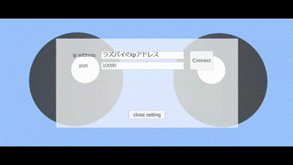
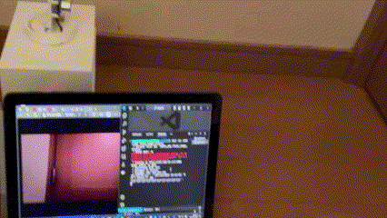
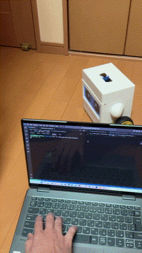
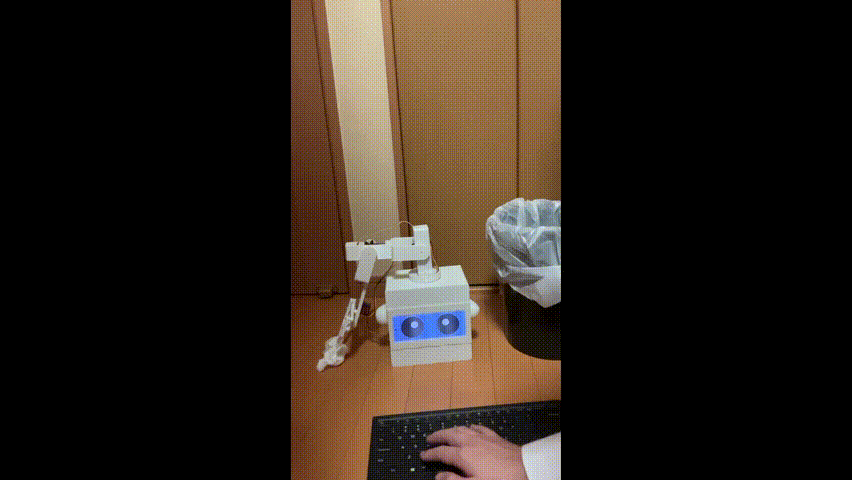

# smabo

[日本語版はこちら](./README_jp.md)

> [!IMPORTANT]
> This is the repository for the old smabo.
> 
> It is no longer under active development, and this repository is deprecated.
>
>
> The repository for the greatly powered-up new smabo is below.
> 
> [smabo-smartphone-robot](https://github.com/smabo-smartphone-robot)


<br>
<br>
<br>
<br>
<br>
<br>


---

[How to build a robot that holds a smartphone【smabo】](https://zenn.dev/akinami/books/f8f2effbc79894) (Japanese)


This is a repository related to smabo, a robot that holds a smartphone.
- [smabo](#smabo)
- [What is smabo](#what-is-smabo)
- [Setting up smabo](#setting-up-smabo)
  - [Installing and configuring the required packages](#installing-and-configuring-the-required-packages)
  - [Creating a workspace for smabo](#creating-a-workspace-for-smabo)
  - [Cloning the repository and copying the packages](#cloning-the-repository-and-copying-the-packages)
  - [Building the packages](#building-the-packages)
  - [Installing the smabo app](#installing-the-smabo-app)
- [How to use smabo](#how-to-use-smabo)
  - [Communicating with smabo over ROS2](#communicating-with-smabo-over-ros2)
    - [Launching ROS-TCP-Endpoint](#launching-ros-tcp-endpoint)
    - [Launching the smabo app](#launching-the-smabo-app)
    - [Changing smabo's facial expression](#changing-smabos-facial-expression)
  - [Getting the smartphone's sensor data on the Raspberry Pi](#getting-the-smartphones-sensor-data-on-the-raspberry-pi)
    - [Gyroscope](#gyroscope)
    - [Acceleration](#acceleration)
    - [Compass](#compass)
  - [Controlling smabo's arms (pca9685, sg90)](#controlling-smabos-arms-pca9685-sg90)
    - [Without ROS2](#without-ros2)
    - [With ROS2](#with-ros2)
  - [Controlling smabo's head (pca9685, sg90)](#controlling-smabos-head-pca9685-sg90)
    - [With ROS2](#with-ros2-1)
  - [Getting data from the ultrasonic sensor (hc-sr04)](#getting-data-from-the-ultrasonic-sensor-hc-sr04)
    - [Without ROS2](#without-ros2-1)
    - [With ROS2](#with-ros2-2)
  - [Controlling smabo's camera (openCV, flask)](#controlling-smabos-camera-opencv-flask)
    - [Without ROS2](#without-ros2-2)
    - [With ROS2](#with-ros2-3)
  - [Controlling it as a mobile robot](#controlling-it-as-a-mobile-robot)
    - [Without ROS2](#without-ros2-3)
    - [With ROS2](#with-ros2-4)
- [Controlling the robot arm](#controlling-the-robot-arm)
    - [With ROS2](#with-ros2-5)

# What is smabo


smabo is a robot that holds a smartphone, and it can do a variety of things, such as:

- Navigation
- Motion planning
- Image processing
- Remote control
- Deep learning
- Bipedal walking

https://github.com/akinami3/smabo/assets/151462572/efaf8d19-57ab-4605-b386-3ae562e6a525

This repository is intended to bring together code and other resources related to smabo.

<br>

# Setting up smabo
For detailed setup instructions for smabo, please see the following blog (in Japanese).

[How to build a robot that holds a smartphone【smabo】](https://zenn.dev/akinami/books/f8f2effbc79894)


<br>

This README only covers the basic environment setup and usage.
## Installing and configuring the required packages
Please install ROS2 (Humble) by referring to the following site.
https://docs.ros.org/en/humble/Installation/Alternatives/Ubuntu-Development-Setup.html

<br>

Running `source /opt/ros/humble/setup.bash` lets you use the ros2 command, but typing it every time you open a terminal is tedious, so run the following command.
```bash
echo "source /opt/ros/humble/setup.bash" >> ~/.bashrc
```

<br>
Install the GPIO package.

```bash
sudo apt update -y && sudo apt install -y \
python3-rpi.gpio
```

<br>

Also, please set up the RPi.GPIO package so it can be used without sudo, referring to the following site.  
[【Raspberry Pi + Ubuntu】How to fix the "failed to add edge detection" error when using add_event_detect without sudo](https://qiita.com/akinami/items/90323c1bb010db9683a5) (Japanese)

<br>

Install the other required packages.
```bash
pip install adafruit-pca9685 # Package for the servo driver pca-9685
```
```bash
pip install opencv-contrib-python # openCV (image processing)
```
```bash
pip install ipget # Get the IP address
```
```bash
pip install readchar # Single-character input
```
```bash
pip install flask # flask (web application framework)
```

## Creating a workspace for smabo
Create a workspace for smabo with the following command.
```bash
mkdir -p smabo_ws/src
```

## Cloning the repository and copying the packages
Clone this repository with the following command.
```bash
cd ~/
```
```bash
git clone https://github.com/akinami3/smabo.git
```
<br>
Next, copy the smabo packages into the workspace's src directory with the following command.

```bash
cp -r ~/smabo/smabo_pkgs ~/smabo_ws/src
```
<br>
In addition to the smabo-related packages, also clone "ROS-TCP-Endpoint," the package needed to communicate with Unity over ROS2 (used for communication between the smartphone and the Raspberry Pi).

```bash
cd ~/smabo_ws/src
```

```bash
git clone -b dev-ros2 https://github.com/Unity-Technologies/ROS-TCP-Endpoint.git
```

## Building the packages
Build the workspace with the following command.
```bash
cd ~/smabo_ws
```
```bash
colcon build --symlink-install
```
<br>

Next, make it so the built packages can be launched via the ros2 command.

```bash
source ~/smabo_ws/install/setup.bash
```

Running this command every time you open a terminal is tedious, so add it to `.bashrc` as well.

```bash
echo "source ~/smabo_ws/install/setup.bash" >> ~/.bashrc
```
## Installing the smabo app
Download the "SmartPhoneRobot.apk" from the repository to your smartphone and install it.

<br>
<br>

# How to use smabo
This section explains how to use smabo.
## Communicating with smabo over ROS2
### Launching ROS-TCP-Endpoint
Launch the server for communicating between Unity and ROS with the following command.

```bash
ros2 run ros_tcp_endpoint default_server_endpoint
```
### Launching the smabo app
On your smartphone, launch the installed smart_phone_robot (smabo) app.

When you launch the app, an options screen for entering the IP address and port number is displayed.

- ip address: the Raspberry Pi's IP address
- port: 10000

Enter these values and click the "Connect" button.

After clicking the button and waiting a moment, if "connected!!!!!!!" is displayed, the connection is complete.




> [!NOTE]
> If, after trying several times, "not connected" keeps being displayed, check whether **the Raspberry Pi and the smartphone may be connected to different networks**.

### Changing smabo's facial expression


The following command launches the node that changes smabo's facial expression.

```bash
ros2 run smabo_pkg impression_pub
```

Once the node is launched, you can change smabo's expression by entering an integer between 0 and 5.

## Getting the smartphone's sensor data on the Raspberry Pi

### Gyroscope


The following command launches the node that retrieves the smartphone's gyroscope data.

```bash
ros2 run smabo_pkg gyro_sub
```

### Acceleration
The following command launches the node that retrieves the smartphone's acceleration data.

```bash
ros2 run smabo_pkg accel_sub
```

### Compass
The following command launches the node that retrieves the smartphone's compass data.
```bash
ros2 run smabo_pkg magnetic_sub
```


## Controlling smabo's arms (pca9685, sg90)
Connect the right arm's servo to pin 6 and the left arm's servo to pin 7 of the pca9685 before proceeding.


<br>

Change the permissions of i2c-1.
```bash
sudo chmod 666 /dev/i2c-1
```

### Without ROS2
Run the program, and entering an integer between -90 and 90 degrees moves smabo's arm to the specified angle.
```bash

cd ~/smabo/simple_code
```
```bash
python3 pca9685_simple_hand.py
```
### With ROS2
Launch the node that controls the pca9685.
```bash
ros2 run smabo_pkg pca9685_controller
```

Next, open a new terminal and launch the node that controls smabo's arm.
```bash
ros2 run smabo_pkg simple_hand_angle_commander
```
With this node launched, entering an integer between -90 and 90 degrees moves smabo's arm to the specified angle.

## Controlling smabo's head (pca9685, sg90)


<br>

Change the permissions of i2c-1.
```bash
sudo chmod 666 /dev/i2c-1
```
Connect the head's servo to pin 5 of the pca9685 before proceeding.

### With ROS2
Launch the node that controls the pca9685.
```bash
ros2 run smabo_pkg pca9685_controller
```

Next, open a new terminal and launch the node that controls smabo's head.
```bash
ros2 run smabo_pkg head_arrow_key_commander 
```
With this node launched, pressing the "z" key rotates it to the left, and pressing the "x" key rotates it to the right.

## Getting data from the ultrasonic sensor (hc-sr04)


<br>

An hc-sr04 is used as the ultrasonic sensor.

### Without ROS2
Run the code that retrieves distance data from the ultrasonic sensor.
```bash
cd ~/smabo/simple_code
```
```bash
python3 ultrasonic_sr04.py 
```
When you run the code, the distance (cm) measured by the ultrasonic sensor is displayed as shown below.
```bash
13.17 cm
13.18 cm
13.21 cm
13.20 cm
13.21 cm
```

### With ROS2
Launch the node that retrieves distance data from the ultrasonic sensor.
```bash
ros2 run smabo_pkg ultrasonic_sensor
```

When you run the code, the distance (m) measured by the ultrasonic sensor is displayed as shown below.
```bash
[INFO] [1704560652.946915129] [ultrasonic_sensor]: distance: 0.04410195350646973 m
[INFO] [1704560652.951719651] [ultrasonic_sensor]: distance: 0.1263386607170105 m
[INFO] [1704560653.041953099] [ultrasonic_sensor]: distance: 0.12637817859649658 m
[INFO] [1704560653.143156803] [ultrasonic_sensor]: distance: 0.12622010707855225 m
[INFO] [1704560653.242842910] [ultrasonic_sensor]: distance: 0.12665480375289917 m
```

## Controlling smabo's camera (openCV, flask)


<br>

Change the permissions of video0.
```bash
sudo chmod 666 /dev/video0
```
### Without ROS2
Run the code that displays the images captured from the camera on a flask server.
```bash
cd ~/smabo/simple_code
```
```bash
python3 cam_stream_on_flask.py
```
Accessing the address shown in the terminal (192.168.\*\*\*.\*\*\*:5000/) displays the images captured from the camera.

### With ROS2
Launch the node that captures images from the camera.
```bash
ros2 run smabo_pkg cam_stream 
```

Open a new terminal and launch the node that displays, via flask, the images subscribed to from the /image topic.
```bash
ros2 run smabo_pkg flask_image_display
```
Accessing the address shown in the terminal (192.168.\*\*\*.\*\*\*:5000/) displays the images captured from the camera.

## Controlling it as a mobile robot

### Without ROS2
Run the code that controls smabo as a mobile robot.
```bash
cd ~/smabo/simple_code
```
```bash
python3 control_move_smabo.py
```

You can control it by pressing the following keys on the keyboard.  

q w e r   
a s d  
z x c v  

s: stop  
w: move forward  
x: move backward  
d: rotate right (in place)  
a: rotate left (in place)  
e: left wheel forward only  
c: left wheel backward only  
q: right wheel forward only  
z: right wheel backward only  
r: speed up
v: slow down

### With ROS2
Launch the node that controls the DC motors for the mobile robot.
```bash
ros2 run smabo_pkg move_robot_dc_controller 
```

Open a new terminal and launch the node that sends driving commands to the DC motor control node.
```bash
ros2 run smabo_pkg move_robot_commander 
```
You can control it by pressing the following keys on the keyboard.  

q w e r   
a s d  
z x c v  

s: stop  
w: move forward  
x: move backward  
d: rotate right (in place)  
a: rotate left (in place)  
e: left wheel forward only  
c: left wheel backward only  
q: right wheel forward only  
z: right wheel backward only  
r: speed up
v: slow down

# Controlling the robot arm



Change the permissions of i2c-1.
```bash
sudo chmod 666 /dev/i2c-1
```

Connect each servo to the following pins of the pca9685:
- link1 (shared with the head servo): pin 5
- link2: pin 13
- link3: pin 14
- gripper: pin 15

### With ROS2
Launch the node that controls the pca9685.
```bash
ros2 run smabo_pkg pca9685_controller
```

Next, open a new terminal and launch the node that sets each link and the gripper of the robot arm.
```bash
ros2 run smabo_pkg link3_robot_arm_commander
```
You can control it by pressing the following keys on the keyboard.

q w e  
a s d  
z x  

z: rotate link1 in the positive direction    
x: rotate link1 in the negative direction  
q: rotate link2 in the positive direction  
a: rotate link2 in the negative direction  
w: rotate link3 in the positive direction  
s: rotate link3 in the negative direction  
e: open the gripper  
d: close the gripper  
