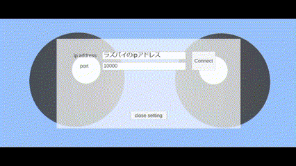

# smabo
スマートフォンが入るロボットsmaboに関するリポジトリです。
- [smabo](#smabo)
- [smaboとは](#smaboとは)
- [smaboのセットアップ](#smaboのセットアップ)
  - [必要パッケージのインストール、設定](#必要パッケージのインストール設定)
  - [smabo用ワークスペースの作成](#smabo用ワークスペースの作成)
  - [リポジトリのクローン、パッケージのコピー](#リポジトリのクローンパッケージのコピー)
  - [パッケージのビルド](#パッケージのビルド)
  - [smaboアプリのインストール](#smaboアプリのインストール)
- [smaboの使い方](#smaboの使い方)
  - [smaboをROS2で通信](#smaboをros2で通信)
    - [ROS-TCP-Endpointの起動](#ros-tcp-endpointの起動)
    - [smaboアプリの起動](#smaboアプリの起動)
    - [smaboの表情を変更する](#smaboの表情を変更する)
  - [スマホのセンサ情報をラズパイで取得する](#スマホのセンサ情報をラズパイで取得する)
    - [ジャイロ](#ジャイロ)
    - [加速度](#加速度)
    - [コンパス](#コンパス)
  - [smaboの腕を制御（pca9685, sg90）](#smaboの腕を制御pca9685-sg90)
    - [ROS2を使用しない](#ros2を使用しない)
    - [ROS2を使用](#ros2を使用)
  - [smaboの頭を制御（pca9685, sg90）](#smaboの頭を制御pca9685-sg90)
    - [ROS2を使用](#ros2を使用-1)
  - [超音波センサからの情報を取得 (hc-sr04)](#超音波センサからの情報を取得-hc-sr04)
    - [ros2を使用しない](#ros2を使用しない-1)
    - [ros2を使用する。](#ros2を使用する)
  - [smaboのカメラを制御 (openCV, flask)](#smaboのカメラを制御-opencv-flask)
    - [ROS2を使用しない](#ros2を使用しない-2)
    - [ROS2を使用](#ros2を使用-2)
  - [移動ロボットとして制御](#移動ロボットとして制御)
    - [ROS2を使用しない](#ros2を使用しない-3)
    - [ROS2を使用](#ros2を使用-3)

# smaboとは
smaboはスマートフォンが入るロボットであり、

- ナビゲーション (navigation)
- 動作計画 (motion planning)
- 画像処理 (image processing)
- 遠隔操作 (remote control)
- 深層学習 (deep learning)
- 二足歩行 (bipedal walking)

など様々なことができます。

https://github.com/akinami3/smabo/assets/151462572/efaf8d19-57ab-4605-b386-3ae562e6a525

本リポジトリでは、smaboに関係するコード等をまとめていく予定です。

<br>

# smaboのセットアップ
smaboの詳しいセットアップについては以下ブログにて解説しているので、ぜひご覧ください。

[スマホが入るロボットの作り方【smabo】](https://akinami3.com/smabo_summary)


<br>

本READMEでは、基本的な環境構築手順、使用法についてのみ解説します。
## 必要パッケージのインストール、設定
下記サイトを参考に、ROS2(humble)をインストールしてください。
https://docs.ros.org/en/humble/Installation/Alternatives/Ubuntu-Development-Setup.html

<br>

 `source /opt/ros/humble/setup.bash` を実行すると、ros2コマンドを実行できるのですが、ターミナルを開くたびに入力するのは面倒なので、下記コマンドを実行しましょう。
```bash
echo "source /opt/ros/humble/setup.bash" >> ~/.bashrc
```

<br>
GPIOのパッケージをインストールします。

```bash
sudo apt update -y && sudo apt install -y \
python3-rpi.gpio
```

<br>

また、下記サイトを参考にsudoなしで RPi.GPIO パッケージを使うためのセットアップを実施してください。  
[【ラズパイ+ubuntu】sudoなしでadd_event_detectを使うとfailed to add edge detectionエラーが出るときの解決方法](https://qiita.com/akinami/items/90323c1bb010db9683a5)

<br>

その他、必要なパッケージをインストールします
```bash
pip install adafruit-pca9685 # サーボドライバpca-9685のパッケージ
```
```bash
pip install opencv-contrib-python # openCV（画像処理）
```
```bash
pip install ipget # ipアドレスを取得
```
```bash
pip install readchar # 一文字入力
```
```bash
pip install flask # flask(Webアプリケーションフレームワーク)
```

## smabo用ワークスペースの作成
以下コマンドで、smabo用のワークスペースを作成してください
```bash
mkdir -p smabo_ws/src
```

## リポジトリのクローン、パッケージのコピー
以下コマンドで、本リポジトリをcloneしてください。
```bash
cd ~/
```
```bash
git clone https://github.com/akinami3/smabo.git
```
<br>
次に、以下コマンドでsmabo用のパッケージをワークスペースのsrcディレクトリにコピーしてください

```bash
cp -r ~/smabo/smabo_pkgs ~/smabo_ws/src
```
<br>
smabo関連のパッケージ以外に、「unityをROS2で通信するために必要なパッケージ」である「ROS-TCP-Endpoint」もcloneします（スマホとラズパイの通信に使用します）。

```bash
cd ~/smabo_ws/src
```

```bash
git clone -b dev-ros2 https://github.com/Unity-Technologies/ROS-TCP-Endpoint.git
```

## パッケージのビルド
以下コマンドで、ワークスペースをビルドしてください
```bash
cd ~/smabo_ws
```
```bash
colcon build --symlink-install
```
<br>

次に、以下コマンドでros2コマンドからビルドしたパッケージを起動できるようにします。

```bash
source ~/smabo_ws/install/setup.bash
```

ターミナルを起動するたびに上記コマンドを実行するのは面倒なので、 `.bashrc` にも記述しておきます。

```bash
echo "source ~/smabo_ws/install/setup.bash" >> ~/.bashrc
```
## smaboアプリのインストール
リポジトリ内の「SmartPhoneRobot.apk」をスマホにダウンロードし、インストールしてください。

<br>
<br>

# smaboの使い方
ここからは、smaboの使い方について説明します。
## smaboをROS2で通信
### ROS-TCP-Endpointの起動
以下コマンドで、unityをROSで通信するためのサーバーを起動します。

```bash
ros2 run ros_tcp_endpoint default_server_endpoint
```
### smaboアプリの起動
スマホ側で、インストールしたsmart_phone_robot（smabo用アプリ）を起動します。

アプリを起動すると、ipアドレスとポート番号を入力するオプション画面が表示されるので
- ip address : ラズパイ側のipアドレス
- port : 10000

と入力して「Connect」ボタンをクリックしてください。

ボタンをクリックし、しばらく待った後に「connected!!!!!!!」と表示されれば、接続が完了しています。




> [!NOTE]
> この時、何度か試してみても「not connected」と表示され続ける場合は、**ラズパイとスマホが異なるネットワークに接続されている可能性がある**ので確認してみてください。

### smaboの表情を変更する


以下コマンドで、smaboの表情を変更するノードが起動します。

```bash
ros2 run smabo_pkg impression_pub
```

ノードを起動したら、「0～5の間の整数」を入力することでsmaboの表情を変化させることが出来ます。

## スマホのセンサ情報をラズパイで取得する

### ジャイロ


以下コマンドで、スマホのジャイロの情報を取得するノードが起動します。

```bash
ros2 run smabo_pkg gyro_sub
```

### 加速度
以下コマンドで、スマホの加速度を取得するノードが起動します。

```bash
ros2 run smabo_pkg accel_sub
```

### コンパス
以下コマンドで、スマホのコンパス情報を取得するノードが起動します。
```bash
ros2 run smabo_pkg magnetic_sub
```


## smaboの腕を制御（pca9685, sg90）
右腕用のサーボはpca9685の6pin、左腕用のサーボは7pinに接続した状態で実施してください。


<br>

i2c-1の権限を変更します。
```bash
sudo chmod 666 /dev/i2c-1
```

### ROS2を使用しない
プログラムを実行し、「-90～90度」の間の整数を入力すると、smaboの腕を指定した角度に動かすことができます。
```bash

cd ~/smabo/simple_code
```
```bash
python3 pca9685_simple_hand.py
```
### ROS2を使用
「pca9685を制御するノード」を立ち上げます。
```bash
ros2 run smabo_pkg pca9685_controller
```

次に、新しいターミナルを立ち上げて「smaboの腕を制御するノード」を立ち上げます。
```bash
ros2 run smabo_pkg simple_hand_angle_commander
```
上記のノードを立ち上げ、「-90～90度」の間の整数を入力すると、smaboの腕を指定した角度に動かすことができます。

## smaboの頭を制御（pca9685, sg90）


<br>

i2c-1の権限を変更します。
```bash
sudo chmod 666 /dev/i2c-1
```
頭用のサーボはpca9685の5pinに接続した状態で実施してください。

### ROS2を使用
「pca9685を制御するノード」を立ち上げます。
```bash
ros2 run smabo_pkg pca9685_controller
```

次に、新しいターミナルを立ち上げて「smaboの頭を制御するノード」を立ち上げます。
```bash
ros2 run smabo_pkg head_arrow_key_commander 
```
上記のノードを立ち上げ、"z"キーを入力すると左方向に回転、"x"キーを入力すると右方向に回転します。

## 超音波センサからの情報を取得 (hc-sr04)


<br>

超音波センサにはhc-sr04を使用します。

### ros2を使用しない
「超音波センサからの距離情報を取得するコード」を実行します。
```bash
cd ~/smabo/simple_code
```
```bash
python3 ultrasonic_sr04.py 
```
コードを実行すると下記のように、超音波センサで計測した距離(cm)が表示されます。
```bash
13.17 cm
13.18 cm
13.21 cm
13.20 cm
13.21 cm
```

### ros2を使用する。
「超音波センサからの距離情報を取得するノード」を立ち上げます。
```bash
ros2 run smabo_pkg ultrasonic_sensor
```

コードを実行すると下記のように、超音波センサで計測した距離(m)が表示されます。
```bash
[INFO] [1704560652.946915129] [ultrasonic_sensor]: distance: 0.04410195350646973 m
[INFO] [1704560652.951719651] [ultrasonic_sensor]: distance: 0.1263386607170105 m
[INFO] [1704560653.041953099] [ultrasonic_sensor]: distance: 0.12637817859649658 m
[INFO] [1704560653.143156803] [ultrasonic_sensor]: distance: 0.12622010707855225 m
[INFO] [1704560653.242842910] [ultrasonic_sensor]: distance: 0.12665480375289917 m
```

## smaboのカメラを制御 (openCV, flask)


<br>

video0 の権限を変更します。
```bash
sudo chmod 666 /dev/video0
```
### ROS2を使用しない
「カメラから取得した画像をflaskのサーバ上で表示するコード」を実行します。
```bash
cd ~/smabo/simple_code
```
```bash
python3 cam_stream_on_flask.py
```
ターミナル上に表示されるアドレス(192.168.\*\*\*.\*\*\*:5000/)にアクセスするとカメラから取得された画像が表示されます。

### ROS2を使用
「カメラから画像を取得するノード」を立ち上げます。
```bash
ros2 run smabo_pkg cam_stream 
```

新しくターミナルを立ち上げて、「/imageトピックから購読した画像をflask上で表示するノード」を立ち上げます。
```bash
ros2 run smabo_pkg flask_image_display
```
ターミナル上に表示されるアドレス(192.168.\*\*\*.\*\*\*:5000/)にアクセスするとカメラから取得された画像が表示されます。

## 移動ロボットとして制御

### ROS2を使用しない
「移動ロボットのsmaboを制御するコード」を実行します。
```bash
cd ~/smabo/simple_code
```
```bash
python3 control_move_smabo.py
```

キーボードの以下ボタンを押すことで制御できます。  

q w e   
a s d  
z x c  

s: 停止  
w: 前進  
x: 後進  
d: 右回転（その場回転）  
a: 左回転（その場回転）  
e: 左車輪のみ前進  
c: 左車輪のみ後退  
q: 右車輪のみ前進  
z: 右車輪のみ後退  

### ROS2を使用
「移動ロボット用のdcモータを制御するノード」を立ち上げます。
```bash
ros2 run smabo_pkg move_robot_dc_controller 
```

新しくターミナルを立ち上げて、「dcモータ制御用ノードに走行指示を送るノード」を立ち上げます。
```bash
ros2 run smabo_pkg move_robot_commander 
```
キーボードの以下ボタンを押すことで制御できます。  

q w e   
a s d  
z x c  

s: 停止  
w: 前進  
x: 後進  
d: 右回転（その場回転）  
a: 左回転（その場回転）  
e: 左車輪のみ前進  
c: 左車輪のみ後退  
q: 右車輪のみ前進  
z: 右車輪のみ後退  